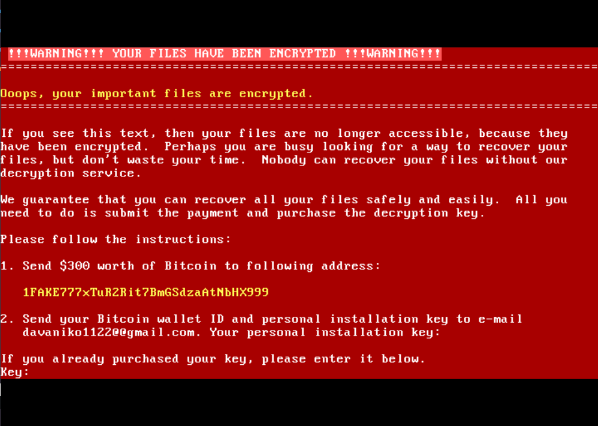

A custom x86 Bootloader project (NotPetya-style) consisting of a First Stage (boot.asm) and a Second Stage (stage2.asm). This project demonstrates low-level hardware interaction, BIOS interrupts, and VGA overscan manipulation.



## **⚠️ CRITICAL WARNING**

**THIS PROJECT IS POTENTIALLY DESTRUCTIVE.** \* Running the build outputs on a physical machine **WILL OVERWRITE YOUR MBR (Master Boot Record)**.

* This will render your operating system unbootable and result in data loss.  
* **ONLY** run the resulting files inside a virtual machine (like QEMU).

## ** Compilation (Raw Mode)**

To build the raw floppy/disk image and run it safely in QEMU:

1. **Assemble the code:**
   ```  
   nasm \-f bin boot.asm \-o boot.bin  
   nasm \-f bin stage2.asm \-o stage2.bin
   ```
3. **Combine stages into one image:**
   ``` 
   cat boot.bin stage2.bin \> lexus.img
   ```
4. **Run safely in QEMU:**
   ```
   #linux:
   qemu-system-x86_64 -drive format=raw,file=lexus.img \
   -audiodev pa,id=snd0 -machine pcspk-audiodev=snd0 \
   -vga std -display gtk,zoom-to-fit=on

   #Windows:
   qemu-system-x86_64 -drive format=raw,file=lexus.img \
   -audiodev dsound,id=snd0 -machine pcspk-audiodev=snd0 \
   -vga std -display sdl,zoom-to-fit=on

   #macOS:
   qemu-system-x86_64 -drive format=raw,file=lexus.img \
   -audiodev coreaudio,id=snd0 -machine pcspk-audiodev=snd0 \
   -vga std -display cocoa
   ```
## ** Build Windows Executable (.EXE)**

If you have the main.c wrapper and a Mingw-w64 environment, you can use the make command:

make

### ** EXE EXECUTION WARNING**

Even though this generates a .exe file, **DO NOT run lexus\_mbr.exe on your host Windows machine.** The executable is designed to write the bootloader data directly to the physical drive (MBR).

**If you must test the EXE, do it ONLY inside a Windows Virtual Machine.**

**The Makefile performs the following:**

* Compiles boot.asm and stage2.asm to binary.  
* Converts binaries to C headers using xxd.  
* Compiles the final Windows executable:  
  i686-w64-mingw32-gcc \-m32 \-Os \-Wall \-s \-static \-Wl,--subsystem,windows \-o lexus\_mbr.exe main.c

## ** Project Details**

* **Type:** x86 Bootloader (Real Mode)  
* **Default Password:** 1028952853  
* **Features:** Red screen UI, Fake MFT loading bar, Panic blink effect.
* **⚠️ Technical Warning**
Even if the correct password (1028952853) is entered, it will not restore access to the original operating system. The Master Boot Record (MBR) has been permanently replaced by this bootloader, overwriting the original boot code.
